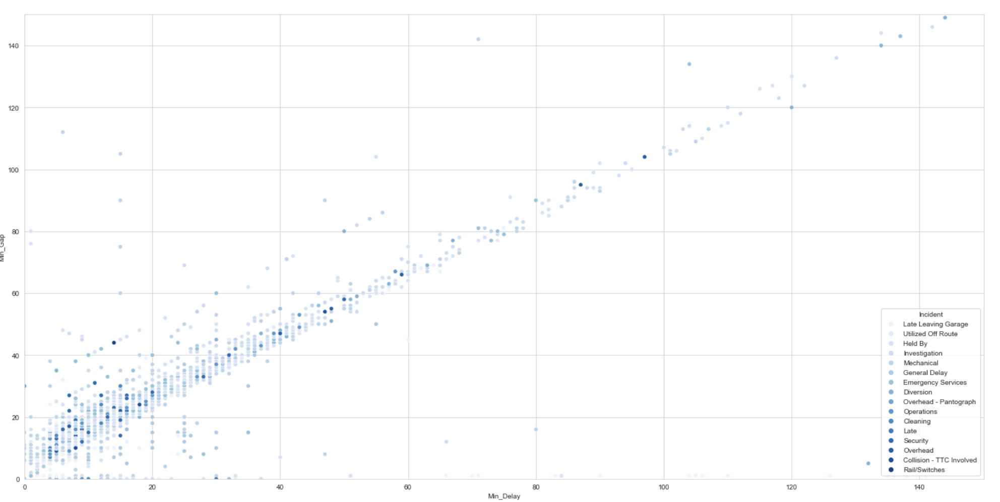
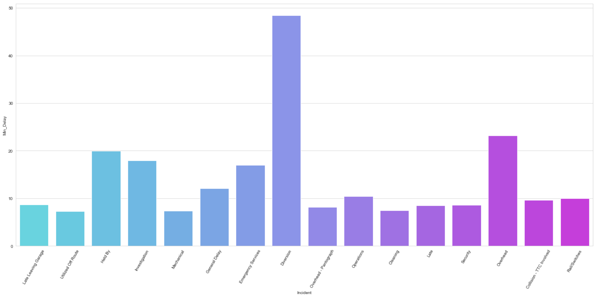
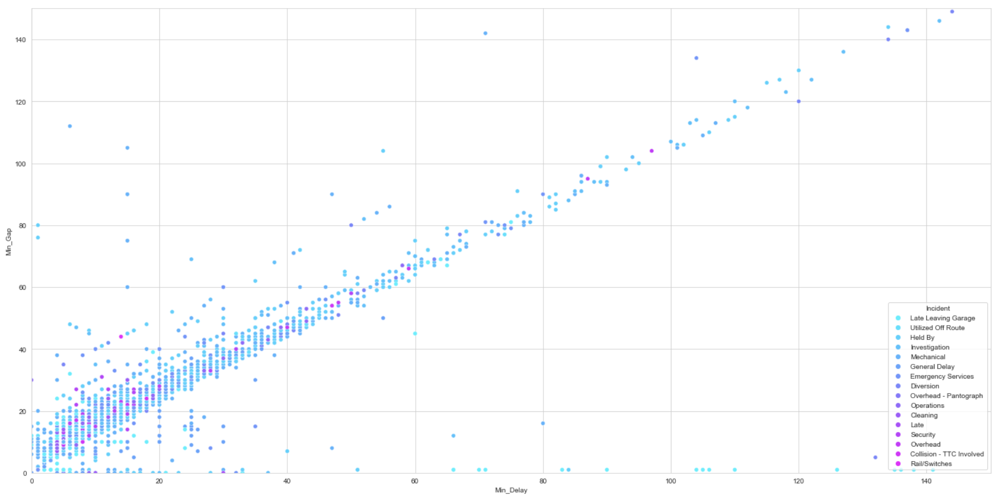
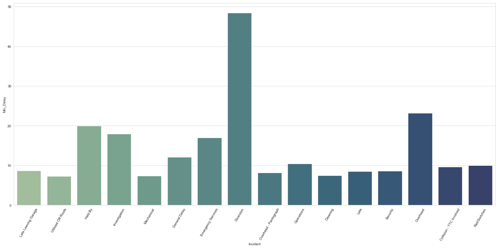
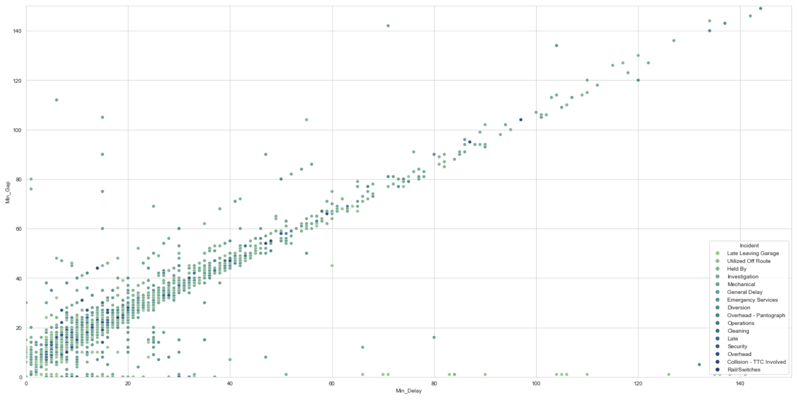
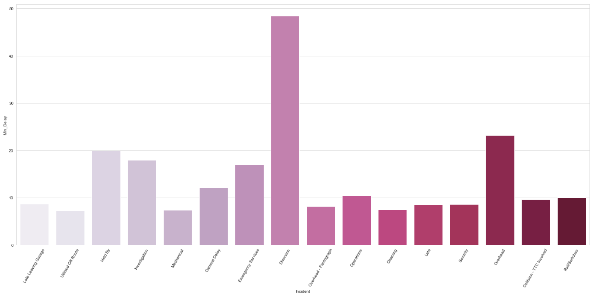
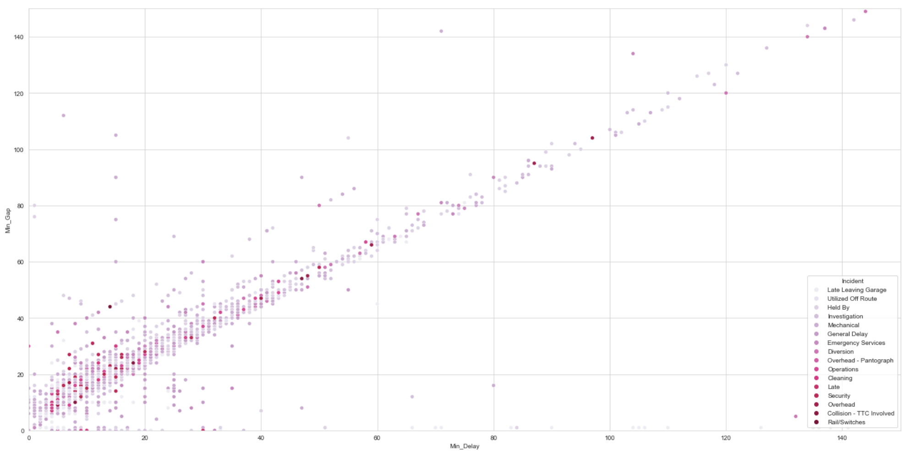
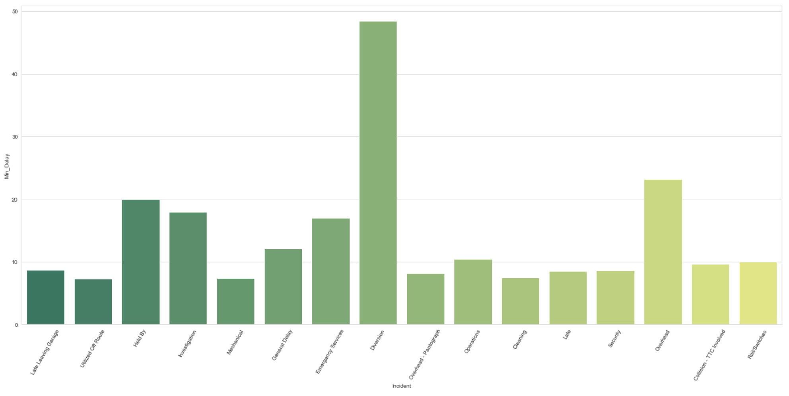
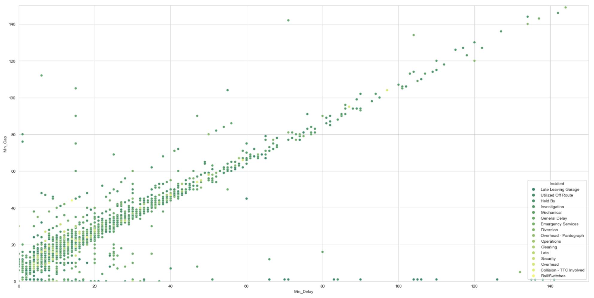

# sns-color-palette

I've created a visualization of all colour palettes offered in `seaborn`. Below are a few of my favourites, but to see all of them, please look at the "sns-color-palette.ipynb" file.

# blues

  

  

#  cool

  

  

# crest

  

  

# PuRd

  

  

# summer

  

  